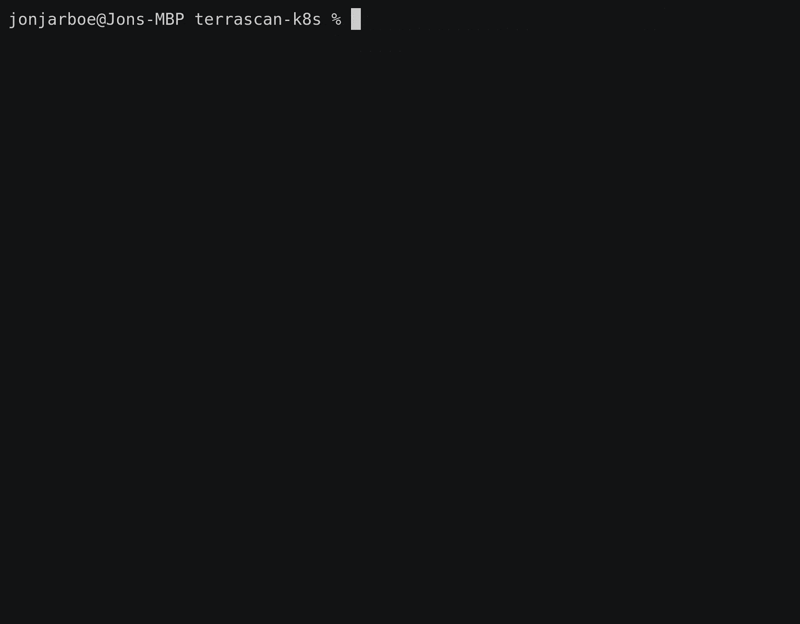

Accurics is excited to announce Terrascan v1.1.0, with Kubernetes (k8s) support!  Cloud native apps and infrastructure are notoriously complex and difficult to secure with traditional tools, and kubernetes adds automation and orchestration that es##calate those problems to another level.  Practically speaking, security automation is mandatory because it’s not realistic to expect humans to comprehend such complex, dynamic environments.

[Terrascan](http://accurics.com/products/terrascan) is an extensible, open source tool that enables teams to detect compliance and security violations across Infrastructure as Code to mitigate risk before provisioning cloud native infrastructure.  By adding k8s support to Terrascan, we’re ensuring that all teams, regardless of budget, have access to the tools they need to secure their cloud native apps and infrastructure well before they are ever deployed in the cloud.

[Release 1.1.0](https://github.com/accurics/terrascan/releases/tag/v1.1.0) works with k8s YAML and JSON configurations, and includes policies for security risks present in those files.  Future releases will add support for k8s infrastructure managed through other IaC providers such as Terraform.

## Using Terrascan with Kubernetes

Terrascan is usually run as a portable Go binary or a Docker container.  Its command line interface can easily be adapted to run it from a terminal, a script, from within a pipeline, and numerous other contexts.  To use it, simply run terrascan from a directory where your kubernetes project lives.

``` terrascan scan -t k8s ```

Terrascan defaults to scanning YAML and JSON files in the current directory and subdirectories.  If your project spans multiple directories, you can use the -d option one or more times to specify which directories to scan.  

By default, output is sent to the terminal in YAML format.



The structured output includes a summary of the results as well as the details needed to prioritize and fix the findings.  It’s suitable for humans to read, and for programmatic processing.

We’re just getting started, and we’re excited about the opportunity to help teams secure their cloud native apps and infrastructure.  Join us in the [Community Discord](https://discord.gg/accurics-community)  for more Terrascan tips and tricks, and stay tuned for more exciting announcements about new technologies and policies that cover even more of the cloud native landscape.