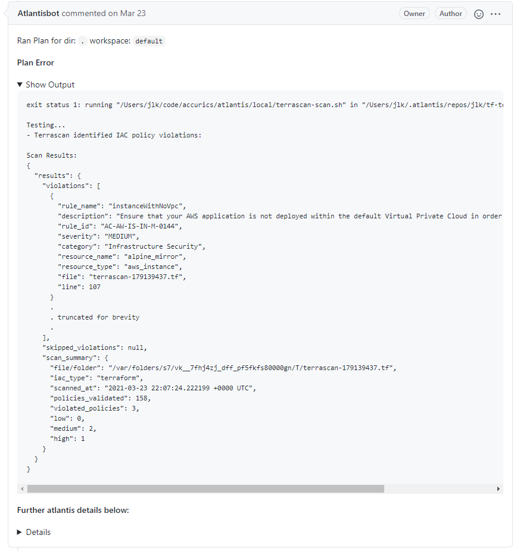

[Atlantis](https://www.runatlantis.io/) is a popular open source automation platform for [Terraform](http://terraform.io) that leverages an organization’s code repository, such as Git, to streamline and automate Terraform workflows. At its most basic:

* New Terraform code is introduced as a pull request
* Atlantis automatically creates a Terraform plan with the new changes.
* A colleague reviews the pull request, a common development practice.
* Atlantis will apply the new plan when it receives the command, deploying new cloud infrastructure.

This is a very powerful way to manage complex cloud infrastructure across multiple teams. Moreover, the version control system naturally provides useful features like version control, permission management and audit logs.

At Accurics, we are most excited about how the entire workflow is managed as a single pull request thread. Moreover, at the end of the process, the Terraform code repository should reflect the actual deployed infrastructure. While not explicitly a GitOps approach for Terraform automation, a lot of the core tenets are present. We work well in GitOps workflows, so we decided to explore whether we can seamlessly integrate Terrascan into the Atlantis workflow. 

## Terraform Security with Atlantis and Terrascan

[Terrascan](https://github.com/accurics/terrascan) is an infrastructure as Code (IaC) security scanner. Powered by hundreds of OPA’s Rego security policies, it scans Terraform source code and detects security vulnerabilities embedded within them. It allows users to fix vulnerable infrastructure before it is ever deployed. Scanning can be done at different stages of the deployment lifecycle. Ideally, it would be done in multiple stages.

By integrating Terrascan directly into the Atlantis workflow, scan results are reported as part of the same pull request workflow, which will inform the pull request reviewer before approving. In the spirit of automation, Terrascan can fail the automated plan build if a vulnerability of a certain severity is found.

Of course, that is not the only place that Terrascan can fit in the development lifecycle. A developer can scan their code as they are writing it. Terrascan’s Github Action can automatically scan new code as it is pushed, which could actually reduce the turnaround time for a fix. To enforce policy at the organizational level, just before code is applied as infrastructure, integrating Terrascan into the Atlantis flow provides a welcome new level of security.

## Getting Started with Terrascan in Atlantis

Terrascan supports being run as a server on a separate environment, so only network connectivity is required to integrate Terrascan into existing Atlantis environments. For even more flexibility, we will soon publish an Atlantis container image that includes the Terrascan binary.

To integrate Terrascan into your Atlantis deployment, please follow the steps in our [documentation](https://runterrascan.io/docs/integrations/atlantis/).
